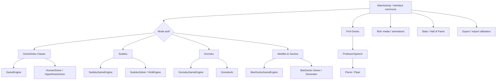

# GeckoDoku — fonctionnement actuel

> Documentation vivante de l'application telle qu'elle existe au 28 septembre 2026.
>
> **Version applicative observée :** `0.15.15-dev` — `versionCode 50`  
> **Branche :** `gecko-039-sudoku-tap-gecko-gomoku`  
> **Référence code fonctionnel :** `8ccc0385c8314239976368811dab93808970e35a`  
> Cette documentation décrit le comportement présent. Elle peut évoluer avec le logiciel. Elle n'est ni un historique de debug ni un ordre de mission.

## 1. But général

GeckoDoku est une application Android de jeux de logique centrée sur plusieurs variantes partageant une interface commune, un Prof Gecko pédagogique appelé Pierre pour la voix, des statistiques locales, un Hall of Fame, des sauvegardes utilisateur et des animations optionnelles.

Les quatre modes disponibles sont :

1. **GeckoDoku** — puzzle logique original sur grille carrée.
2. **Sudoku** — Sudoku 9×9 avec saisie, candidats, repères et aide du Prof.
3. **Gomoku** — plateau 19×19 avec zoom/déplacement, contre Prof Gecko ou humain contre humain.
4. **Abeilles & Geckos** — puzzle logique hexagonal avec zones, axes Q/R/S et appariement Gecko ↔ Abeille.

Le titre affiché reste **GeckoDoku 🦎** quel que soit le mode.

---

## 2. Navigation générale

Le bouton **⚙️ Réglages** ouvre le sélecteur de mode et les fonctions communes.

### Choix du mode

Le menu propose :

- 🦎 GeckoDoku
- 🔢 Sudoku
- 🟩 Gomoku contre Prof Gecko
- 👥 Gomoku humain contre humain
- 🐝 Abeilles & Geckos

Le dernier mode, la difficulté choisie, la taille Classic, le type de partie Gomoku et le style visuel Sudoku sont mémorisés localement.

### Boutons principaux

Selon le mode, l'écran peut afficher :

- **Taille** — GeckoDoku uniquement, de 5×5 à 12×12.
- **Difficulté** — choix parmi les huit niveaux quand le mode l'utilise.
- **↻ Nouvelle** — génère ou démarre une nouvelle partie. Pendant une génération logique longue Classic ou Abeilles & Geckos, le bouton devient **✕ Annuler**.
- **↺ Rejouer** — recommence la partie courante.
- **Stats** — visible directement en Classic ; les statistiques restent accessibles depuis ⚙️ dans les autres modes.
- **!** — fait parler Pierre avec une petite intervention contextuelle.
- **⚙️** — ouvre les réglages.
- **Prof Gecko** — demande une aide pédagogique ; son appui long peut appliquer directement une étape dans certains modes.
- **⭐ Sauver / ★ Grille sauvegardée** — Classic uniquement.
- **📚 Journal** — Classic uniquement.

Les plateaux restent des surfaces indépendantes des bulles/vidéos du Prof : les overlays pédagogiques ne doivent pas modifier la géométrie logique du plateau.

---

## 3. Difficultés

La gamme commune comporte huit niveaux :

- Découverte
- Facile
- Réflexion
- Difficile
- Expert
- Démentiel
- Mission Impossible
- Infernal

En GeckoDoku et Abeilles & Geckos, une demande de difficulté déclenche une recherche de grille correspondant réellement au niveau demandé ; la génération peut donc continuer jusqu'à trouver une grille conforme ou être annulée.

En Gomoku contre Prof Gecko, la difficulté règle la profondeur et la fiabilité stratégique de Pierre. En humain contre humain, le bouton de difficulté est masqué car aucun adversaire IA n'a besoin d'être réglé.

---

## 4. Mode GeckoDoku — règles et gestes

### Règle du puzzle

La grille carrée a une taille de **5×5 à 12×12**. Une solution contient un Gecko confirmé par ligne.

Un Gecko confirmé exclut automatiquement les autres cases :

- de sa ligne ;
- de sa colonne ;
- de sa région ;
- des cases qui le touchent, diagonales comprises.

Les Geckos donnés par la grille sont verrouillés.

Une grille valide possède une solution unique et sa difficulté est évaluée par le solveur logique du programme.

### Gestes

- **Tap simple** : pose/retire une croix manuelle lorsque la case le permet.
- **Double-clic** : ouvre les repères logiques :
  - 🟢 Gecko ;
  - 🟡 Hypothèse ;
  - 🔴 Axe.
- **Appui long** : fait évoluer l'hypothèse sur une case.
- **Repères personnels** : plusieurs symboles sont disponibles, dont !, ?, ★, ●, ◆, ↗, +, ◉ et Gecko arc-en-ciel.

### Axes personnels

Après **Double-clic → Axe** :

1. choisir **Horizontal** ou **Vertical** ;
2. choisir la couleur :
   - 🟡 Jaune ;
   - 🟢 Vert ;
   - 🔴 Rouge ;
3. la barre est posée ;
4. elle peut être glissée ;
5. si elle est sortie du plateau, elle est supprimée.

La couleur et le type de l'axe sont conservés pendant le déplacement.

### Prof Gecko en Classic

Le Prof utilise le solveur logique. Il ne doit pas inventer un coup : il montre une étape cohérente avec l'état courant.

Selon le raisonnement, il peut visualiser les cellules sources, exclusions et axes utiles. Ses axes pédagogiques restent indépendants des couleurs personnelles choisies par le joueur.

---

## 5. Mode Sudoku

Le mode Sudoku utilise une grille **9×9** classique avec chiffres donnés verrouillés.

### Gestes

- **Tap simple** : sélectionne une case ou bascule le marqueur Gecko prévu par l'interface.
- **Double-clic** : ouvre les repères personnels.
- **Appui long** : ouvre la palette de saisie rapide.

La palette de saisie permet :

- entrer un chiffre 1–9 ;
- poser/retirer des candidats ;
- basculer le marqueur Gecko ;
- effacer le contenu modifiable de la case.

Un chiffre faux est refusé et compte comme erreur. Lorsqu'un chiffre est placé correctement, il est retiré des candidats des cases pairs de même ligne, colonne et bloc 3×3.

### Annuler / refaire

Deux boutons sont affichés :

- **↶ Annuler**
- **↷ Refaire**

Ils agissent sur l'historique local des modifications Sudoku.

### Styles visuels

Trois styles existent :

- chiffres classiques ;
- Gecko noir et blanc ;
- Gecko couleur.

Le style change la représentation, pas la logique du Sudoku.

### Prof Gecko en Sudoku

- **Appui normal sur Prof Gecko** : explique une étape ou prépare l'étape suivante.
- **Appui long sur Prof Gecko** : demande une intervention directe du Prof.

Les explications peuvent utiliser candidats, projection graphique et raisonnement détaillé. L'aide directe coûte davantage dans le calcul des étoiles qu'un simple conseil.

---

## 6. Mode Gomoku

### Plateau et victoire

Le plateau courant est **19×19**. Les joueurs posent alternativement leurs pièces ; cinq pièces alignées horizontalement, verticalement ou en diagonale gagnent la partie.

### Navigation

Le plateau est exploratoire :

- **tap** : joue dans une intersection/case libre ;
- **glisser** : déplace la vue ;
- **pincer à deux doigts** : zoom avant/arrière.

La vue démarre autour d'une zone d'environ **12×12** et peut se réduire jusqu'à environ **5×5** visibles.

### Contre Prof Gecko

- le joueur humain joue **Vert** ;
- Pierre/Prof Gecko joue l'autre camp ;
- après le coup humain, le Prof calcule son propre coup ;
- le bouton Prof peut donner un conseil pendant le tour du joueur ;
- un appui long peut appliquer le coup conseillé pour le joueur puis laisser Pierre jouer son tour.

La difficulté contrôle notamment profondeur de recherche, largeur d'exploration, prise en compte des pièges, rayon tactique et fiabilité. Les niveaux faibles peuvent volontairement manquer certaines tactiques immédiates ; les niveaux élevés utilisent une défense/tactique plus fiable.

### Humain contre humain

Les deux camps sont joués manuellement. Le Prof reste conseiller et ne prend pas le contrôle d'un camp.

### Explications graphiques

Le raisonnement Gomoku peut exposer :

- ligne étudiée ;
- menaces ;
- coup conseillé ;
- projection de suite.

---

## 7. Mode Abeilles & Geckos

### Géométrie

Le plateau est hexagonal pointy-top et utilise les trois axes réels de l’écran :

- **Q** = **+60°** = ↖↘
- **S** = **-60°** = ↙↗
- **R** = **0°** = ←→

Ces orientations sont centralisées dans `BeeGeckoAxisGeometry`. La projection du plateau, la légende, la popup Axe du double-clic et les libellés du Prof utilisent cette même source afin qu’un axe annoncé corresponde toujours à la barre réellement dessinée.

La carte peut être déplacée et zoomée. Les réglages offrent également **Recentrer la carte** et **Prochaine zone non résolue**.

### Règles de solution

Chaque zone contient exactement :

- **1 Gecko** ;
- **1 Abeille**.

Le Gecko et l'Abeille d'une paire sont voisins.

L'appariement est exclusif :

- chaque Abeille de solution touche exactement un Gecko de solution ;
- chaque Gecko de solution touche exactement une Abeille de solution.

Pour chaque type de pièce séparément, il ne peut y avoir qu'une pièce sur une même ligne Q, R ou S.

### Gestes et repères

- **Tap simple** : fait évoluer la croix logique :
  - jaune = hypothèse ;
  - verte = déduction sûre ;
  - rouge = impossible ;
  - puis retrait.
- **Double-clic** : palette logique :
  - 🟢 Gecko ;
  - 🟡 Abeille ;
  - 🔴 Axe.
- **Appui long** : repère personnel.

### Axes

Après Axe, choisir Q/S/R puis Jaune/Vert/Rouge.

Les axes :

- sont globaux ;
- peuvent être glissés ;
- conservent leur couleur ;
- sont supprimés s'ils sont sortis du plateau ;
- sont sauvegardés dans la session Abeilles & Geckos.

Le format courant de persistance des axes est **schema 4**. Les anciennes sessions où l'axe n'avait pas de couleur sont relues en **rouge** par défaut.

### Prof Gecko en Abeilles & Geckos

Un appui normal demande un indice logique. Un appui long peut appliquer l'étape proposée.

Le Prof conserve ses propres marqueurs pédagogiques et ne recolore pas automatiquement ses axes avec les couleurs choisies par le joueur.

---

## 8. Prof Gecko / Pierre

Le personnage visible s'appelle **Prof Gecko**. La voix locale est appelée **Pierre** dans l'architecture.

Le flux vocal est :

```text
Texte à dire
→ politique de parole du Prof
→ PierrePiperSpeechEngine
→ PierrePronunciationPolicy
→ Sherpa/Piper local
→ sortie audio Android
```

Le texte affiché et le texte synthétisé peuvent différer uniquement pour améliorer la prononciation. Exemple courant :

```text
affichage : église
Pierre    : eglize
```

Le remplacement intervient au bord du moteur vocal ; le texte UI reste correctement orthographié.

Pierre possède aussi :

- interventions rapides via le bouton **!** ;
- contexte joueur ;
- phrases d'ambiance ;
- mémoire de phrases pour limiter les répétitions ;
- comportement pédagogique spécifique selon le mode.

Une parole pédagogique ne doit pas être interrompue arbitrairement par une animation décorative. Les vidéos et la voix sont des couches distinctes.

---

## 9. Animations, vidéos et audio

Les animations sont optionnelles et peuvent être activées/désactivées dans ⚙️.

Le rendu vidéo utilise des overlays qui ne doivent pas faire bouger le plateau. Les vidéos de gameplay sont visuelles ; lorsqu'elles sont muettes, leur piste audio est réellement désélectionnée.

L'audio de Pierre utilise une politique Android compatible avec la capture de lecture :

- usage média ;
- contenu speech ;
- capture autorisée.

Le manifeste autorise également la capture audio de lecture de l'application.

Le menu **📋 Journal vidéo** permet de consulter les traces média utilisées pour le diagnostic.

---

## 10. Étoiles, erreurs et assistance

Une partie terminée sans aide commence à **5 étoiles**.

L'aide retire de la valeur :

- conseil léger : 1 point d'assistance ;
- coup direct du Prof : 2 points.

Barème de base selon les points d'assistance :

- 0 → 5 étoiles ;
- 1 → 4 ;
- 2–3 → 3 ;
- 4–5 → 2 ;
- davantage → 1.

Chaque erreur retire ensuite **3 étoiles**, avec un minimum final de **1 étoile**.

Les interventions automatiques/de décoration ne sont pas comptées comme une demande d'aide directe.

---

## 11. Statistiques, joueur et Hall of Fame

Les statistiques sont enregistrées localement, globalement et par mode/difficulté.

Elles suivent notamment :

- parties commencées ;
- parties terminées ;
- parties terminées avec Prof ;
- temps ;
- erreurs ;
- étoiles ;
- meilleurs résultats.

Le nom du joueur est modifiable via **👤 Joueur**. Il est utilisé pour les nouveaux résultats du Hall of Fame.

Le **🏆 Hall of Fame** présente les résultats enregistrés par mode/difficulté avec les étoiles correspondantes.

**🗑 Vider l'historique** supprime les entrées du Hall of Fame sans effacer les statistiques agrégées, les réglages ou les grilles du journal.

---

## 12. Journal de grilles Classic

En GeckoDoku Classic :

- **⭐ Sauver la grille** enregistre la grille courante dans le journal local ;
- le bouton devient **★ Grille sauvegardée** lorsqu'elle est déjà enregistrée ;
- **📚 Journal** liste les grilles sauvegardées ;
- une grille peut être rechargée et remise à zéro ;
- une entrée peut être supprimée ;
- le journal entier peut être vidé après confirmation.

---

## 13. Export / import des données

Le menu propose :

- **📤 Exporter mes données**
- **📥 Importer mes données**

L'export crée un fichier JSON du type :

`GeckoDoku-backup-AAAAMMJJ-HHMM.json`

L'import valide le format GeckoDoku avant application. En cas d'échec pendant l'import, l'ancienne situation est restaurée.

Les données couvertes incluent les préférences et données locales utiles de l'application : statistiques, mode/difficulté, profil joueur, historique du Prof, Hall of Fame et autres stores GeckoDoku inclus dans le mécanisme de backup.

---

## 14. Réglages disponibles selon le mode

### GeckoDoku

- Mode de jeu
- Sauver la grille
- Journal de grilles
- Statistiques
- Joueur
- Hall of Fame
- Vider l'historique
- Exporter
- Importer
- Son
- Animations
- Journal vidéo

### Abeilles & Geckos

- Mode de jeu
- Difficulté
- Recentrer la carte
- Prochaine zone non résolue
- Statistiques
- Joueur
- Hall of Fame
- Vider l'historique
- Exporter
- Importer
- Son
- Animations
- Journal vidéo

### Sudoku et Gomoku

- Mode de jeu
- Difficulté, sauf Gomoku humain contre humain
- Statistiques
- Joueur
- Hall of Fame
- Vider l'historique
- Exporter
- Importer
- Son
- Animations
- Journal vidéo

---

## 15. Architecture fonctionnelle simplifiée



---

## 16. Séparation des responsabilités documentaires

Cette documentation répond à : **« Comment l'application se comporte-t-elle et comment l'utiliser aujourd'hui ? »**

Elle ne remplace pas :

- `brain.md` : contrat fonctionnel et décisions courantes ;
- `brainmap.md` : cartographie technique précise des composants et dépendances ;
- `debughistorical.md` : incidents encore utiles au diagnostic ;
- `todo.md` : travail technique restant ;
- `ordres-de-mission.md` : commandes explicites de Fab ;
- `sauvegarde.md` : archive froide à ne pas charger par défaut.

Cette séparation doit permettre de restructurer ensuite les mémoires sans perdre la compréhension globale du logiciel.

---

## 17. État non validé à ne pas confondre avec une fonction stable

Le code de la mission GECKO-048 contient actuellement :

- la correction de prononciation `église → eglize` à l'entrée de Pierre ;
- les axes Jaune / Vert / Rouge ;
- conservation de la couleur pendant le drag ;
- persistance Bee schema 4.

La validation finale sur téléphone de ces éléments reste distincte de leur présence dans le code.


### Delta GECKO-049 — cohérence des axes hexagonaux

La version 0.15.6-dev corrige un décalage purement géométrique d’affichage : les barres réelles étaient alignées sur les cellules, mais les symboles de S et R ne correspondaient pas aux angles du plateau pointy-top.

La correction ne change ni les règles Abeilles & Geckos, ni le solveur, ni le format de session. Elle unifie uniquement la source géométrique utilisée par le rendu, l’interface et le Prof.


### Delta GECKO-050 — mascottes vivantes et sérénité

La version de travail 0.15.7-dev introduit un moteur commun de présence visuelle pour Gecko, Abeille et la Plante décorative.

Quand les animations sont actives, une mascotte peut enchaîner apparition, animations d'attente discrètes et mignonnerie sans repasser brièvement par son PNG entre deux vidéos. Le masque de la pièce statique est conservé pendant toute la chaîne et la taille vidéo est calculée depuis la taille réellement utilisée par le PNG du mode.

Le moteur mémorise les derniers clips et évite une répétition immédiate lorsqu'une alternative existe. Quatre attentes terminées ou la fin d'une mignonnerie provoquent une réinterrogation douce du groupe.

Quand les animations sont désactivées, le jeu revient aux PNG : Gecko/Abeille restent les PNG déjà dessinés par leur plateau ; la Plante utilise `PlanteTr.png`.

Une seule mascotte vivante de chaque type est animée à la fois afin de conserver une charge légère sur téléphone. Les autres pièces restent en PNG.

La Plante est décorative, sans collision ni effet sur les règles. Prof Gecko/Pierre restent sur leur pipeline vidéo/parole séparé.


#### Correctif continuité 0.15.8-dev

Le premier essai téléphone GECKO-050 a montré un bref vide intermittent entre deux clips successifs.

Cause : lorsqu'un nouveau clip est demandé, le lecteur précédent est arrêté et la nouvelle surface reste volontairement transparente jusqu'à sa première frame décodée. Le masque continu empêchait alors le PNG du plateau de réapparaître, laissant momentanément seulement le fond.

Correction : après qu'une mascotte a déjà rendu sa première frame, son PNG transparent canonique de même taille sert de pont uniquement pendant la préparation du clip suivant. Il est retiré exactement dans `onFirstFrameRendered`. La première animation d'apparition ne montre donc toujours aucun PNG prématuré.


#### Refactor autonomie visuelle 0.15.9-dev

Le pipeline vivant n'utilise plus aucune couleur de fond de case. Gecko, Abeille et Plante possèdent leur PNG transparent dans leur profil AliveAnimator. Pendant qu'une instance est vivante, le plateau suspend uniquement le dessin de son ancien PNG statique ; AliveMascotOverlayView devient l'unique propriétaire visuel de cette mascotte.

Le nombre d'instances vidéo reste borné pour protéger le téléphone tout en rendant le plateau plus vivant : trois Gecko, deux Abeilles et une Plante peuvent être animés simultanément. Lorsqu'un pool est plein, l'instance la plus ancienne revient au PNG statique du plateau.

La Plante carnivore est déplaçable par drag. Sa position est mémorisée sous forme normalisée afin de rester cohérente après les changements de dimensions.

Le PNG interne sert aussi de pont entre clips et reçoit la teinte jaune lorsqu'il représente le Gecko du Prof.


#### Nuages des placements donnés 0.15.10-dev

Les placements imposés/grisés conservent une brume visuelle mais elle est désormais beaucoup plus légère. Un moteur commun construit sept petites bouffées irrégulières, avec des tailles et positions légèrement différentes et une opacité comprise entre 8 et 21. Le mouvement reste lent et déterministe par cellule, ce qui évite l'aspect de quatre ellipses géométriques superposées.


#### Mascottes vivantes 0.15.11-dev

Toutes les mascottes visibles sont désormais enregistrées comme Presence légères dans AliveMascotOverlayView, y compris celles déjà présentes lors du chargement d'une partie. Le PNG transparent appartient à la Presence. Les lecteurs vidéo sont séparés et restent bornés à 3 Gecko, 2 Abeilles et 1 Plante simultanément. Le scheduler update() fait tourner ces lecteurs entre toutes les Presence visibles, par ordre d'ancienneté d'animation avec des pauses légèrement aléatoires. Cette architecture est commune aux modes Classic, Sudoku, Gomoku et Abeilles & Geckos.

AliveAnimator change de stay à chaque clip, forme des séries de 3 à 5 stays, évite de reproduire immédiatement une série complète et déclenche à la fin d'un grand cycle une animation cute chez une autre mascotte visible qui en possède une.


#### Diagnostic ALL ANIMATED 0.15.12-dev

Pour isoler un défaut observé sur téléphone, le plafond de lecteurs vidéo est temporairement retiré. AliveMascotOverlayView crée dynamiquement un VideoSlot par Presence visible ; toutes les mascottes peuvent ainsi être animées simultanément. Ce réglage sert à déterminer si le pool borné 3 Gecko / 2 Abeilles était responsable de l'arrêt apparent des animations.

Pendant les deux vidéos d'introduction, la couche AliveMascotOverlayView est suspendue et cachée. Les lecteurs mascottes sont arrêtés afin qu'aucun Gecko ou Plante ne puisse apparaître au-dessus de l'intro. Après fin naturelle ou skip, les Presence reprennent leur PNG interne et leur cycle.


#### Reprise après changement d'application 0.15.13-dev

Quand GeckoDoku passe en arrière-plan, AliveMascotOverlayView est volontairement arrêté afin qu'aucun lecteur vidéo ne continue à fonctionner hors écran. Au retour dans l'application, la couche vivante est maintenant entièrement reconstruite : la Plante est recréée puis les mascottes du mode courant sont resynchronisées depuis le snapshot du moteur. La reprise couvre Classic, Sudoku, Gomoku et Abeilles & Geckos. Le simple aller-retour vers Mail ou Messages ne relance pas l'introduction.


#### Architecture définitive mascottes 0.15.14-dev

Le diagnostic ALL ANIMATED devient la règle permanente : chaque mascotte visible possède son propre PNG transparent, son AliveAnimator et son propre ChromaKeyVideoView. Il n’existe plus de pool, de limite 3/2/1 ni de rotation de lecteurs.

Une mascotte créée avant la fin du layout reste enregistrée et retente localement sa géométrie jusqu’à disponibilité. Les pièces déjà données par une map peuvent donc devenir vivantes sans action du joueur. Un refresh post-layout complète la synchronisation Classic, Sudoku, Gomoku et Abeilles & Geckos.

Pour Gecko, une vraie apparition suit désormais strictement : case vide → vidéo d’apparition → PNG/idle vivant. Les deux intros continuent de suspendre entièrement la couche vivante.

#### Pierre — retours après pause

Le moteur visuel/parole de Pierre reste séparé. La catégorie RETURN contient maintenant 300 phrases. RETURN_AFTER_PAUSE utilise exclusivement ce corpus, conserve 48 h de cooldown individuel, mémorise les 48 derniers IDs et évite autant que possible les mêmes familles d’ouverture ainsi que les formulations lexicalement proches des derniers retours.


#### Composition PNG/vidéo d'une Presence — 0.15.15-dev

Chaque mascotte vivante reste un objet autonome qui possède son PNG et son lecteur vidéo. Pour respecter la nature particulière de GLSurfaceView sous Android, ces deux représentations sont toutefois placées dans deux conteneurs siblings du même overlay plutôt que dans le même FrameLayout.

Le plateau transmet la propriété visuelle à la Presence une seule fois lorsque sa target devient valide. Après ce handoff, les transitions sont internes à la Presence :
PNG interne pendant l'attente et la préparation, vidéo à partir de sa première frame réelle, puis retour immédiat au PNG interne à la fin du clip.

L'apparition est l'exception : le PNG interne reste caché afin d'obtenir vide → vidéo d'apparition → vivant.
Aucun lecteur n'est partagé et aucun ordonnanceur n'existe.
